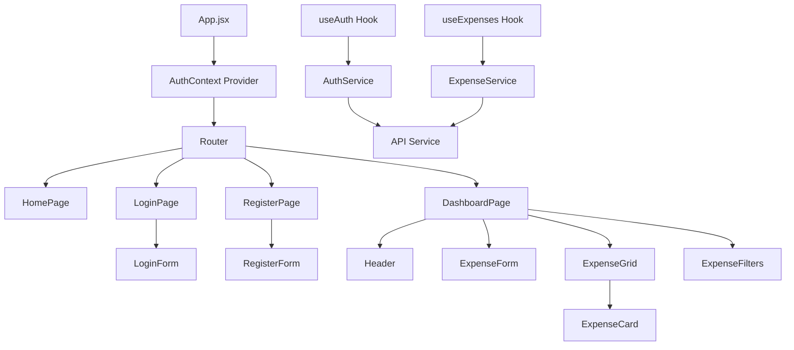
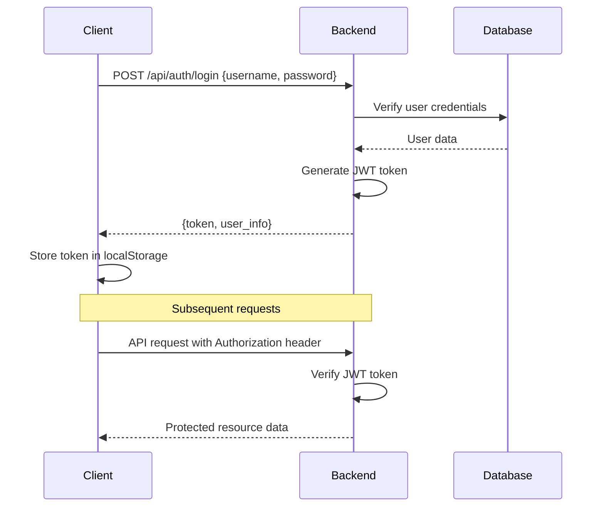
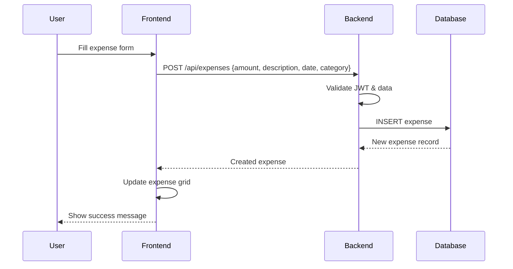

# Expense Tracker Application Architecture

## Overview

This document outlines the complete architecture for an Expense Tracker application designed as a demo project with modern web technologies. The application features user authentication, expense management with CRUD operations, and a responsive grid layout.

## Technology Stack

### Frontend
- **React 18** with functional components and hooks
- **CSS Flexbox** for responsive grid layouts
- **Axios** for API communication
- **React Router** for navigation
- **React Hook Form** for form management

### Backend
- **Flask** (lightweight, perfect for demo projects)
- **Flask-JWT-Extended** for JWT authentication
- **Flask-CORS** for cross-origin requests
- **SQLAlchemy** as ORM
- **Marshmallow** for serialization/validation

### Database
- **SQLite** for development (included with Python)
- **PostgreSQL** for production (easy migration path)

### Development Environment
- **DevContainer** with Python 3.11 and Node.js 18
- **Docker Compose** for orchestrating services

## Project Directory Structure

```
expense-tracker/
├── .devcontainer/
│   ├── devcontainer.json
│   └── Dockerfile
├── backend/
│   ├── app/
│   │   ├── __init__.py
│   │   ├── models/
│   │   │   ├── __init__.py
│   │   │   ├── user.py
│   │   │   └── expense.py
│   │   ├── routes/
│   │   │   ├── __init__.py
│   │   │   ├── auth.py
│   │   │   └── expenses.py
│   │   ├── schemas/
│   │   │   ├── __init__.py
│   │   │   ├── user_schema.py
│   │   │   └── expense_schema.py
│   │   ├── utils/
│   │   │   ├── __init__.py
│   │   │   └── auth_utils.py
│   │   └── config.py
│   ├── migrations/
│   ├── tests/
│   ├── requirements.txt
│   ├── app.py
│   └── .env.example
├── frontend/
│   ├── public/
│   │   ├── index.html
│   │   └── favicon.ico
│   ├── src/
│   │   ├── components/
│   │   │   ├── common/
│   │   │   │   ├── Header.jsx
│   │   │   │   ├── Loading.jsx
│   │   │   │   └── ErrorMessage.jsx
│   │   │   ├── auth/
│   │   │   │   ├── LoginForm.jsx
│   │   │   │   └── RegisterForm.jsx
│   │   │   └── expenses/
│   │   │       ├── ExpenseForm.jsx
│   │   │       ├── ExpenseGrid.jsx
│   │   │       ├── ExpenseCard.jsx
│   │   │       └── ExpenseFilters.jsx
│   │   ├── pages/
│   │   │   ├── HomePage.jsx
│   │   │   ├── LoginPage.jsx
│   │   │   ├── RegisterPage.jsx
│   │   │   └── DashboardPage.jsx
│   │   ├── services/
│   │   │   ├── api.js
│   │   │   ├── authService.js
│   │   │   └── expenseService.js
│   │   ├── context/
│   │   │   └── AuthContext.jsx
│   │   ├── hooks/
│   │   │   ├── useAuth.js
│   │   │   └── useExpenses.js
│   │   ├── utils/
│   │   │   ├── constants.js
│   │   │   └── helpers.js
│   │   ├── styles/
│   │   │   ├── global.css
│   │   │   ├── components/
│   │   │   └── pages/
│   │   ├── App.jsx
│   │   └── index.js
│   ├── package.json
│   └── .env.example
├── docker-compose.yml
├── README.md
└── .gitignore
```

## Database Schema Design

### Users Table
```sql
CREATE TABLE users (
    id INTEGER PRIMARY KEY AUTOINCREMENT,
    username VARCHAR(80) UNIQUE NOT NULL,
    email VARCHAR(120) UNIQUE NOT NULL,
    password_hash VARCHAR(255) NOT NULL,
    created_at DATETIME DEFAULT CURRENT_TIMESTAMP,
    updated_at DATETIME DEFAULT CURRENT_TIMESTAMP
);
```

### Expenses Table
```sql
CREATE TABLE expenses (
    id INTEGER PRIMARY KEY AUTOINCREMENT,
    user_id INTEGER NOT NULL,
    amount DECIMAL(10, 2) NOT NULL,
    description VARCHAR(255) NOT NULL,
    category VARCHAR(50) NOT NULL,
    date DATE NOT NULL,
    created_at DATETIME DEFAULT CURRENT_TIMESTAMP,
    updated_at DATETIME DEFAULT CURRENT_TIMESTAMP,
    FOREIGN KEY (user_id) REFERENCES users (id) ON DELETE CASCADE
);
```

### Predefined Categories
- Food
- Transportation
- Entertainment
- Healthcare
- Shopping
- Utilities
- Other

## API Endpoint Specifications

### Authentication Endpoints

| Method | Endpoint | Description | Request Body | Response |
|--------|----------|-------------|--------------|----------|
| POST | `/api/auth/register` | Register new user | `{username, email, password}` | `{message, user_id}` |
| POST | `/api/auth/login` | User login | `{username, password}` | `{token, user_info}` |
| POST | `/api/auth/logout` | User logout | - | `{message}` |
| GET | `/api/auth/me` | Get current user | - | `{user_info}` |

### Expense Endpoints

| Method | Endpoint | Description | Request Body | Response |
|--------|----------|-------------|--------------|----------|
| GET | `/api/expenses` | Get user's expenses | Query params: `page`, `limit`, `category`, `date_from`, `date_to` | `{expenses[], total, page_info}` |
| POST | `/api/expenses` | Create new expense | `{amount, description, category, date}` | `{expense}` |
| GET | `/api/expenses/{id}` | Get specific expense | - | `{expense}` |
| PUT | `/api/expenses/{id}` | Update expense | `{amount, description, category, date}` | `{expense}` |
| DELETE | `/api/expenses/{id}` | Delete expense | - | `{message}` |
| GET | `/api/expenses/categories` | Get available categories | - | `{categories[]}` |

## Frontend Component Architecture



### Component Responsibilities

#### Pages
- **HomePage**: Landing page with app overview
- **LoginPage**: User authentication
- **RegisterPage**: User registration
- **DashboardPage**: Main expense management interface

#### Components
- **Header**: Navigation and user info
- **ExpenseForm**: Add/edit expense form
- **ExpenseGrid**: Display expenses in responsive grid
- **ExpenseCard**: Individual expense item
- **ExpenseFilters**: Filter expenses by category/date

#### Services
- **authService**: Handle authentication logic
- **expenseService**: Manage expense CRUD operations
- **api**: Centralized API configuration

#### Hooks
- **useAuth**: Authentication state management
- **useExpenses**: Expense data management

## Authentication Flow



## Expense Management Flow



## DevContainer Configuration

### Features
- Python 3.11 with Flask development server
- Node.js 18 for React development
- SQLite for database (no additional setup required)
- Git configuration
- VS Code extensions for Python and React development

### Development Ports
- Frontend: `http://localhost:3000`
- Backend API: `http://localhost:5000`
- Database: SQLite file (no network port needed)

## Error Handling Strategy

### Backend Error Handling
- **Validation Errors** (400): Detailed field-level error messages
- **Authentication Errors** (401): Invalid credentials or missing token
- **Authorization Errors** (403): Valid token but insufficient permissions
- **Not Found Errors** (404): Resource doesn't exist
- **Server Errors** (500): Unexpected server issues

### Frontend Error Handling
- Global error boundary for React component errors
- API error interceptors in Axios for consistent error handling
- User-friendly error messages with actionable feedback
- Loading states for all async operations
- Form validation with real-time feedback

## Security Considerations

### JWT Token Management
- Short token expiration (15 minutes)
- Secure token storage in localStorage
- Automatic token refresh mechanism
- Token blacklisting on logout

### Input Validation
- Server-side validation for all inputs
- Sanitization of user data
- SQL injection prevention via SQLAlchemy ORM
- Cross-site scripting (XSS) protection

### CORS Configuration
- Restrict origins in production environment
- Proper headers configuration
- Credential handling for authentication

## Responsive Grid Layout Strategy

### Flexbox Implementation
- **Mobile-first responsive design**
- **Expense cards in flexible grid layout**
- **Breakpoints**: 
  - Mobile: `< 768px` (1 column)
  - Tablet: `768px - 1024px` (2 columns)
  - Desktop: `> 1024px` (3+ columns)

### CSS Grid Structure
```css
.expense-grid {
  display: flex;
  flex-wrap: wrap;
  gap: 1rem;
  padding: 1rem;
}

.expense-card {
  flex: 1 1 300px;
  min-width: 280px;
  max-width: 400px;
}

@media (max-width: 768px) {
  .expense-card {
    flex: 1 1 100%;
  }
}
```

## Development Workflow

### Setup Process
1. Clone repository
2. Open in DevContainer (VS Code will handle setup automatically)
3. Backend setup runs automatically via DevContainer
4. Frontend dependencies installed automatically

### Development Process
1. **Backend Development**:
   - Flask development server with hot reload
   - SQLAlchemy migrations for database changes
   - Unit testing with pytest
   - API documentation with Flask-RESTX

2. **Frontend Development**:
   - React development server with hot reload
   - Component development with React Developer Tools
   - Responsive design testing with browser dev tools

3. **Integration Testing**:
   - End-to-end testing of authentication flow
   - CRUD operations testing
   - Responsive design verification

### Deployment Strategy
- Docker containerization for production
- Environment-specific configuration files
- Database migration scripts
- CI/CD pipeline ready structure

## Performance Considerations

### Backend Optimization
- Database indexing on user_id and date fields
- Pagination for expense lists
- Caching for category lists
- Connection pooling for database

### Frontend Optimization
- Code splitting with React.lazy()
- Memoization for expensive calculations
- Debounced search and filtering
- Optimistic UI updates for better UX

## Future Enhancement Opportunities

### Potential Features
- Expense analytics and reporting
- Budget tracking and alerts
- Receipt photo upload and OCR
- Multi-currency support
- Data export (CSV, PDF)
- Mobile app with React Native

### Scalability Considerations
- Database migration to PostgreSQL
- Redis for session management
- CDN for static assets
- Load balancing for multiple instances
- Microservices architecture for larger scale

---

This architecture provides a solid foundation for the Expense Tracker application while maintaining simplicity for a demo project. The modular structure allows for easy expansion and modification as requirements evolve.